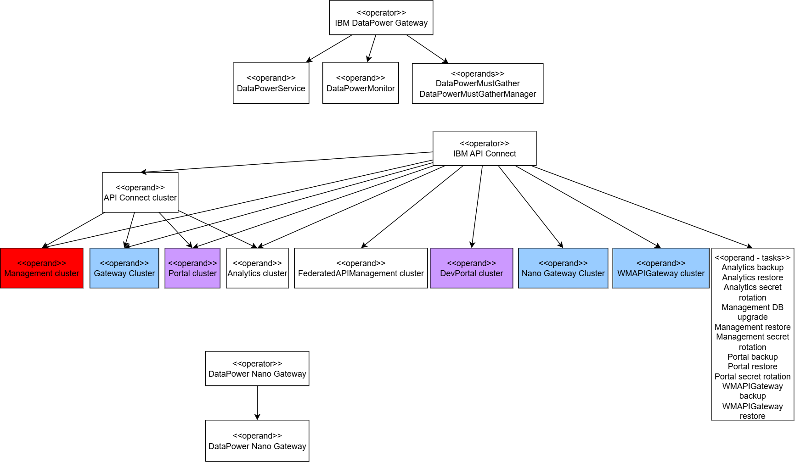

# APIC use cases

## API Tests


## Backup

``` bash
oc -n cp4i create secret generic apic-mgmt-backup-secret --from-literal=username='foo' --from-literal=password='123'
oc -n cp4i get ManagementCluster
oc -n cp4i get cluster
oc -n cp4i create -f mgmtbackup_cr.yaml
oc -n cp4i get backup -o custom-columns="name:.metadata.name,backupId:.status.backupId,endpoint:.status.endpointURL,path:.status.destinationPath,servername:.status.serverName,status:.status.phase"
```

``` bash
kubectl -n <management namespace> create secret generic mgmt-backup-secret --from-literal=username='<username>' --from-file=ssh-privatekey='<privatekeyfile>' [--from-literal=password='<privatekey_passphrase>']
```

``` bash
kubectl -n apic create secret generic mgmt-backup-secret --from-literal=username='itzuser' --from-file=ssh-privatekey='backup.pem'
```

``` bash
kubectl -n <management namespace> edit ManagementCluster
```

``` bash
kubectl -n apic edit ManagementCluster
```

``` bash
  databaseBackup:
    protocol: sftp
    host: 158.175.178.166
    port: 2223
    path: /home/itzuser/backup/apic
    credentials: mgmt-backup-secret
    repoRetentionFull: 14
    schedule: 0 0 1 * * *
```

``` bash
kubectl -n <management namespace> get cluster
kubectl -n apic get cluster
kubectl get cluster -n apic
NAME                     AGE   INSTANCES   READY   STATUS                     PRIMARY
management-ed88e890-db   26d   1           1       Cluster in healthy state   management-ed88e890-db-1
```

``` bash
apiVersion: postgresql.k8s.enterprisedb.io/v1
kind: Backup
metadata:
  generateName: mgmt-backup- # prefix for the name of the backup CR that is generated.
spec:
  cluster:
    name: <database cluster name>
````

``` bash
apiVersion: postgresql.k8s.enterprisedb.io/v1
kind: Backup
metadata:
  generateName: mgmt-backup- # prefix for the name of the backup CR that is generated.
spec:
  cluster:
    name: management-ed88e890-db
```

Create the Backup CR from the mgmtbackup_cr.yaml file:

``` bash
kubectl -n <management namespace> create -f mgmtbackup_cr.yaml
```

Create the Backup CR from the mgmtbackup_cr.yaml file:

``` bash
kubectl -n apic create -f mgmtbackup_cr.yaml
kubectl -n <management namespace> get backup -o custom-columns="name:.metadata.name,backupId:.status.backupId,endpoint:.status.endpointURL,path:.status.destinationPath,servername:.status.serverName,status:.status.phase"
kubectl -n apic get backup -o custom-columns="name:.metadata.name,backupId:.status.backupId,endpoint:.status.endpointURL,path:.status.destinationPath,servername:.status.serverName,status:.status.phase"
name                backupId          endpoint                                   path               servername                                  status
mgmt-backup-bgpbb   20241222T110515   https://management-s3proxy.apic.svc:8765   s3://edb-backups   management-ed88e890-db-2024-11-25T221339Z   completed
```

## Restore

``` bash
kubectl get mgmt -n apic
NAME         READY   STATUS    VERSION         RECONCILED VERSION   MESSAGE               AGE
management   18/18   Running   10.0.8.1-1110   10.0.8.1-1110        Management is ready   87m
kubectl -n <management namespace> get ManagementRestore --sort-by=.metadata.creationTimestamp
kubectl -n apic get ManagementRestore --sort-by=.metadata.creationTimestamp
kubectl -n apic get ManagementRestore --sort-by=.metadata.creationTimestamp
NAME                 STATUS              MESSAGE                                     BACKUP   CLUSTER      PITR   AGE
mgmt-restore-pk4bt   RestoreInProgress   Waiting on management services to disable            management          59s
```

``` yaml
apiVersion: management.apiconnect.ibm.com/v1beta1
kind: ManagementRestore
metadata:
  generateName: mgmt-restore- # this the prefix for the name of the restore CR that is created
spec:
  subsystemName: management
  backup:
    protocol: sftp
    host: 158.175.178.166
    port: 2223
    path: /home/itzuser/backup/apic/management-ed88e890-db-2024-11-25T221339Z
    credentials: mgmt-backup-secret
  backupId: 20241222T110515
```

``` yaml
apiVersion: postgresql.k8s.enterprisedb.io/v1
kind: Backup
metadata:
  generateName: mgmt-backup- # prefix for the name of the backup CR that is generated.
spec:
  cluster:
    name: management-ed88e890-db
```

## AI API Agent

For the installation of Milvus check the install_milvus function, we have chosen a standalone deployment.

### Check Milvus is running

To check milvus is installed 

``` bash
oc get po -n milvus-operator
NAME                                                         READY   STATUS    RESTARTS   AGE
apic-ai-agent-milvus-db-etcd-0                               1/1     Running   0          16h
apic-ai-agent-milvus-db-kafka-0                              1/1     Running   0          16h
apic-ai-agent-milvus-db-kafka-1                              1/1     Running   0          16h
apic-ai-agent-milvus-db-kafka-2                              1/1     Running   0          16h
apic-ai-agent-milvus-db-kafka-zookeeper-0                    1/1     Running   0          16h
apic-ai-agent-milvus-db-kafka-zookeeper-1                    1/1     Running   0          16h
apic-ai-agent-milvus-db-kafka-zookeeper-2                    1/1     Running   0          16h
apic-ai-agent-milvus-db-milvus-standalone-7f7798d4d5-mrtsn   1/1     Running   0          16h
apic-ai-agent-milvus-db-minio-c5c77568c-r86h7                1/1     Running   0          16h
milvus-operator-6f77449dd9-hv5nr                             1/1     Running   0          16h
```

### Getting the service and port

``` bash
NAME                             TYPE           CLUSTER-IP       EXTERNAL-IP   PORT(S)                          AGE
apic-ai-agent-milvus-db-milvus   LoadBalancer   172.30.187.191   <pending>     19530:31104/TCP,9091:30529/TCP   19h
```

### Create the route

``` bash
oc create route edge milvus-route --service=apic-ai-agent-milvus-db-milvus --port=milvus
```

### Test Milvus is working

We are going to use PyMilvus, a Milvus’s Python SDK, to connect to the cluster and perform basic operations.

To interact with Milvus via Python, you need to install the pymilvus package:

``` bash
pip install pymilvus
```

In my case, I had to use a virtual environment for pyhton to be able to download the pymilvus package.

``` bash
cd ~/venvs/
source env/bin/activate
python3 -m pip show pymilvus
Name: pymilvus
Version: 2.6.3
Summary: Python Sdk for Milvus
Home-page: 
Author: Milvus Team
Author-email: milvus-team@zilliz.com
License: 
Location: /home/desprets/venvs/env/lib/python3.12/site-packages
Requires: grpcio, orjson, pandas, protobuf, python-dotenv, setuptools
Required-by: 
```

I'm using the code located on github.com/milvus-io/pymilvus Git repository.
Especially the manage_milvus_client.py file. The instructions are on https://github.com/milvus-io/pymilvus/blob/master/examples/manage_milvus_client/how_to_manage_milvus_client.md.


Update and Use tools/connect.py to test connection (python3 connect.py)
Update and Use tools/test.py to test milvusdb
Update and Use tools/chgpasswd.py to change default root password

### Configure APIC Custom Resources

The instructions provide information on enabloing the AI API Agent in APIC [here](https://www.ibm.com/docs/en/api-connect/software/10.0.x_cd?topic=subsystem-enabling-api-agent-management). Basically, 

### Configure APIC API Agent

Notice that this is done at an organisation level

SaaS


onPrem


### Configure VS Code extension

You need to download the VS code plugin for API Agent from the Cloud Manager first. (AI must be enabled first in the CRD)


When the plugin (extension: .vsix) for example api-agent-vscode-plugin-10.0.10-165 is downloaded, you can set it up in VS Code. In VS Code, In the left panel, open Extensions, click the Views and More Actions icon (...), and select Install from VSIX.


Configure host to API Manager and login


### Testing API Connect Agent


#### List API

#### Create test

#### Create mock API

#### NLP Processing

## APIC V12 Installation

### DataPower nano gateway

https://community.ibm.com/community/user/blogs/anagha-biju/2025/12/12/understanding-deployment-modes-in-the-api-connect




## Valkey in cluster mode research

valkey bootstrapping
During bootstrapping, the cluster nodes:
 - Discover each other and form the cluster membership.
 - Assign all 16,384 hash slots across the primary nodes.
 - Persist the cluster configuration so that valkey-cli --cluster check would report [OK] All 16384 slots covered once done.
 ​
If any of these steps fails or never completes, the cluster can appear to remain in a bootstrapping or “joining” state.

Common causes
Check for these frequent problems:
 Not all nodes reachable: At least one primary node is down, has the wrong IP/port, or is blocked by firewall/NetworkPolicy, so the cluster never fully forms a connected mesh.
Slots not fully assigned: If the bootstrapping tool or script fails partway, some slots may remain unassigned, and the cluster will not transition to a healthy, stable state.
​
Inconsistent node configuration: Mismatched cluster-config-file, cluster-node-timeout, or persistent config files left from a previous cluster can confuse nodes and stall cluster convergence.
Network or DNS issues in Kubernetes: When running on Kubernetes, wrong service names, headless service misconfiguration, or pod DNS problems can prevent nodes from discovering each other, so the bootstrap job never completes.
 ​
Things to check immediately
On one of the nodes (or through your management tooling):
 Run valkey-cli --cluster check host:port to see if all slots are covered and whether nodes show as fail or handshake.
​
Run valkey-cli cluster nodes on a pod/node to verify that all nodes appear with correct IPs and ports, and no nodes are stuck without a proper address or marked as “disconnected”.
Inspect logs of:
 The bootstrapping job or operator (if using Kubernetes).
 Each Valkey node container/service for errors about joining, slots, or bus connections.
Remediation options
Depending on what you find:
 If old cluster state is present but you want a fresh cluster, stop nodes and use CLUSTER RESET (or recreate pods) so they rejoin cleanly with a new configuration.
If some nodes never joined because of network or DNS, fix the connectivity (services, firewalls, cluster-announce-ip/cluster-announce-port) and re-run the bootstrap procedure.
If hash slots are partially assigned, re-run the cluster creation or use the cluster management tool to assign all 16,384 slots, then re-check the cluster.
 ​
If you share:
 How/where you deploy Valkey (bare metal, Docker, Kubernetes, cloud service).
 Output of valkey-cli --cluster check and cluster nodes from one node.
it becomes possible to pinpoint exactly why your cluster is stuck in bootstrapping and give more precise commands to fix it.
----------------------------------------------------------------------------------------------------------------------------------------------------------------
oc -n cp4i describe Valkeycluster valkey-cluster
oc -n cp4i get po |grep -i valkey
valkey-cluster-follower-0
valkey-cluster-follower-1
valkey-cluster-follower-2
valkey-cluster-leader-0
	/node-conf from node-conf (rw)
    /opt/ibm/valkey/config/ from config (rw)

valkey-cluster-leader-1
valkey-cluster-leader-2
valkey-operator-668db98458-f5vbw
oc -n cp4i describe po valkey-cluster-leader-0
oc -n cp4i describe StatefulSet/valkey-cluster-leader
	VALKEY_ADDR:           valkey://localhost:6379
	    Liveness:   exec [sh -c valkey-cli -h $(hostname) -p ${VALKEY_PORT} -a ${VALKEY_PASSWORD} --tls --cert ${VALKEY_TLS_CERT} --key ${VALKEY_TLS_CERT_KEY} --cacert ${VALKEY_TLS_CA_KEY} ping] delay=0s timeout=1s period=10s #success=1 #failure=3
		Readiness:  exec [sh -c valkey-cli -h $(hostname) -p ${VALKEY_PORT} -a ${VALKEY_PASSWORD} --tls --cert ${VALKEY_TLS_CERT} --key ${VALKEY_TLS_CERT_KEY} --cacert ${VALKEY_TLS_CA_KEY} ping] delay=0s timeout=1s period=10s #success=1 #failure=3
	cluster-announce-ip 10.130.1.80
	cluster-announce-hostname valkey-cluster-leader-0.valkey-cluster-leader-headless.cp4i.svc.cluster.local

oc -n cp4i get secret valkey-tls-2
oc -n cp4i get secret valkey-cp4i-secret
----------------------------------------------------------------------------------------------------------------------------------------------------------------
ls -l /usr/local/bin
ls -l /usr/bin

oc -n cp4i exec valkey-cluster-leader-0 -- redis-cli cluster info
valkey-cli --tls --cert /tls/tls.crt --key /tls/tls.key --cacert /tls/ca.crt -a <password> cluster info
valkey-cli --tls --cert /tls/tls.crt --key /tls/tls.key --cacert /tls/ca.crt -a <password> cluster nodes
valkey-cli --tls --cert /tls/tls.crt --key /tls/tls.key --cacert /tls/ca.crt -a <password> cluster slots
valkey-cli --tls --cert /tls/tls.crt --key /tls/tls.key --cacert /tls/ca.crt -a <password> cluster myid
valkey-cli --tls --cert /tls/tls.crt --key /tls/tls.key --cacert /tls/ca.crt -a <password> cluster shards
valkey-cli --tls --cert /tls/tls.crt --key /tls/tls.key --cacert /tls/ca.crt -a <password> cluster myshardid
valkey-cli --tls --cert /tls/tls.crt --key /tls/tls.key --cacert /tls/ca.crt -a <password> cluster replicas 3956fc5e5b08b3444bf766feb3578dd6ab08a150
valkey-cli --tls --cert /tls/tls.crt --key /tls/tls.key --cacert /tls/ca.crt -a <password> cluster slaves 3956fc5e5b08b3444bf766feb3578dd6ab08a150
---------------------------------------------------------------------------------------------------------------------------------------------------------------
https://valkey.io/topics/cluster-spec/
https://valkey.io/topics/cluster-tutorial/
----------------------------------------------------------------------------------------------------------------------------------------------------------------
CLUSTER HELP (null)   summary: Returns helpful text about the different subcommands.
CLUSTER INFO (null)   summary: Returns information about the state of a node.
	cluster_state:fail
	cluster_slots_assigned:0
	cluster_slots_ok:0
	cluster_slots_pfail:0
	cluster_slots_fail:0
	cluster_known_nodes:1
	cluster_size:0
	cluster_current_epoch:0
	cluster_my_epoch:0
	cluster_stats_messages_sent:0
	cluster_stats_messages_received:0
	total_cluster_links_buffer_limit_exceeded:0
CLUSTER MYID (null)   summary: Returns the ID of a node.
	>>> 3956fc5e5b08b3444bf766feb3578dd6ab08a150
CLUSTER NODES (null)   summary: Returns the cluster configuration for a node.
	>>> 3956fc5e5b08b3444bf766feb3578dd6ab08a150 10.130.1.80:6379@16379,valkey-cluster-leader-0.valkey-cluster-leader-headless.cp4i.svc.cluster.local myself,master - 0 0 0 connected
CLUSTER ping
valkey-cli -h localhost -p 6379 -a <password> --tls --cert /tls/tls.crt --key /tls/tls.key --cacert /tls/ca.crt ping
	>>> PONG
CLUSTER LINKS (null)   summary: Returns a list of all TCP links to and from peer nodes.
	>>> when KO (empty array)
CLUSTER REPLICAS node-id   summary: Lists the replica nodes of a primary node.
	>>> when KO (empty array)
CLUSTER SLAVES node-id   summary: Lists the replica nodes of a primary node.
	>>> when KO (empty array)
CLUSTER SHARDS (null)   summary: Returns the mapping of cluster slots to shards.
	1) 1) "slots"
	   2) (empty array)
	   3) "nodes"
	   4) 1)  1) "id"
			  2) "3956fc5e5b08b3444bf766feb3578dd6ab08a150"
			  3) "tls-port"
			  4) (integer) 6379
			  5) "ip"
			  6) "10.130.1.80"
			  7) "endpoint"
			  8) "valkey-cluster-leader-0.valkey-cluster-leader-headless.cp4i.svc.cluster.local"
			  9) "hostname"
			 10) "valkey-cluster-leader-0.valkey-cluster-leader-headless.cp4i.svc.cluster.local"
			 11) "role"
			 12) "master"
			 13) "replication-offset"
			 14) (integer) 0
			 15) "health"
			 16) "online"
CLUSTER SLOTS (null)   summary: Returns the mapping of cluster slots to nodes.
	>>> when KO (empty array)
CLUSTER MYSHARDID (null)   summary: Returns the shard ID of a node.
	>>> b32cbc607ee1b3b6775c42aef4ca7ad9c28cbfa3
CLUSTER ADDSLOTS slot [slot ...]   summary: Assigns new hash slots to a node.
CLUSTER ADDSLOTSRANGE start-slot end-slot [start-slot end-slot ...]   summary: Assigns new hash slot ranges to a node.
CLUSTER BUMPEPOCH (null)   summary: Advances the cluster config epoch.
CLUSTER COUNT-FAILURE-REPORTS node-id   summary: Returns the number of active failure reports active for a node.
CLUSTER COUNTKEYSINSLOT slot   summary: Returns the number of keys in a hash slot.
CLUSTER DELSLOTS slot [slot ...]   summary: Sets hash slots as unbound for a node.
CLUSTER DELSLOTSRANGE start-slot end-slot [start-slot end-slot ...]   summary: Sets hash slot ranges as unbound for a node.
CLUSTER FAILOVER [FORCE|TAKEOVER]   summary: Forces a replica to perform a manual failover of its primary.
CLUSTER FLUSHSLOTS (null)   summary: Deletes all slots information from a node.
CLUSTER FORGET node-id   summary: Removes a node from the nodes table.
CLUSTER GETKEYSINSLOT slot count   summary: Returns the key names in a hash slot.
CLUSTER KEYSLOT key   summary: Returns the hash slot for a key.
CLUSTER MEET ip port [cluster-bus-port]   summary: Forces a node to handshake with another node.
CLUSTER REPLICATE node-id   summary: Configure a node as replica of a primary node.
CLUSTER RESET [HARD|SOFT]   summary: Resets a node.
CLUSTER SAVECONFIG (null)   summary: Forces a node to save the cluster configuration to disk.
CLUSTER SET-CONFIG-EPOCH config-epoch   summary: Sets the configuration epoch for a new node.
CLUSTER SETSLOT slot IMPORTING node-id|MIGRATING node-id|NODE node-id|STABLE [TIMEOUT timeout]   summary: Binds a hash slot to a node.
CLUSTER SLOT-STATS SLOTSRANGE start-slot end-slot|ORDERBY metric [LIMIT limit] [ASC|DESC]   summary: Return an array of slot usage statistics for slots assigned to the current node.
----------------------------------------------------------------------------------------------------------------------------------------------------------------
install_apic


tls-cert-file /tls/tls.crt
tls-key-file /tls/tls.key
tls-ca-cert-file /tls/ca.crt
tls-auth-clients yes
tls-replication yes
tls-cluster yes
cluster-preferred-endpoint-type hostname
port 0
tls-port 637

----------------------------------------------------------------------------------------------------------------------------------------------------------------
cd C:\CurrentProjects\CP4I\Installation\cp4i-install\tmp\certs
setup-valkey-cert.bat cp4i valkey-tls-2
----------------------------------------------------------------------------------------------------------------------------------------------------------------
cat /node-conf/nodes.conf
cat /opt/ibm/valkey/config/valkey.conf
	bind 0.0.0.0 ::
	tcp-backlog 511
	timeout 0
	tcp-keepalive 300
	daemonize no
	supervised no

	dir /mnt/data
	masterauth tpyz-4R*%dqK.DrAbkps
	requirepass tpyz-4R*%dqK.DrAbkps
	protected-mode yes
	cluster-enabled yes
	cluster-node-timeout 5000
	cluster-require-full-coverage no
	cluster-migration-barrier 1
	cluster-config-file /node-conf/nodes.conf
	tls-cert-file /tls/tls.crt
	tls-key-file /tls/tls.key
	tls-ca-cert-file /tls/ca.crt
	tls-auth-clients yes
	tls-replication yes
	tls-cluster yes
	cluster-preferred-endpoint-type hostname
	port 0
	tls-port 6379
	cluster-announce-ip 10.130.0.194
	cluster-announce-hostname valkey-cluster-leader-0.valkey-cluster-leader-headless.cp4i.svc.cluster.local
----------------------------------------------------------------------------------------------------------------------------------------------------------------
openssl s_client -connect valkey-cluster-leader-0.valkey-cluster-leader-headless.cp4i.svc.cluster.local:6379 -CAfile /tmp/ca.crt -cert /tmp/tls.crt -key /tmp/tls.key
----------------------------------------------------------------------------------------------------------------------------------------------------------------