# APIC use cases

## API Tests

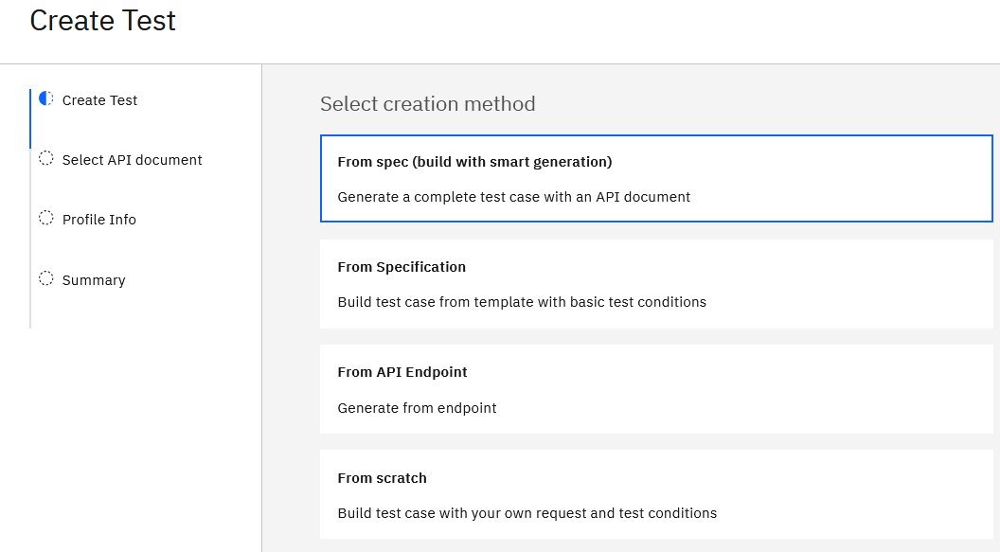

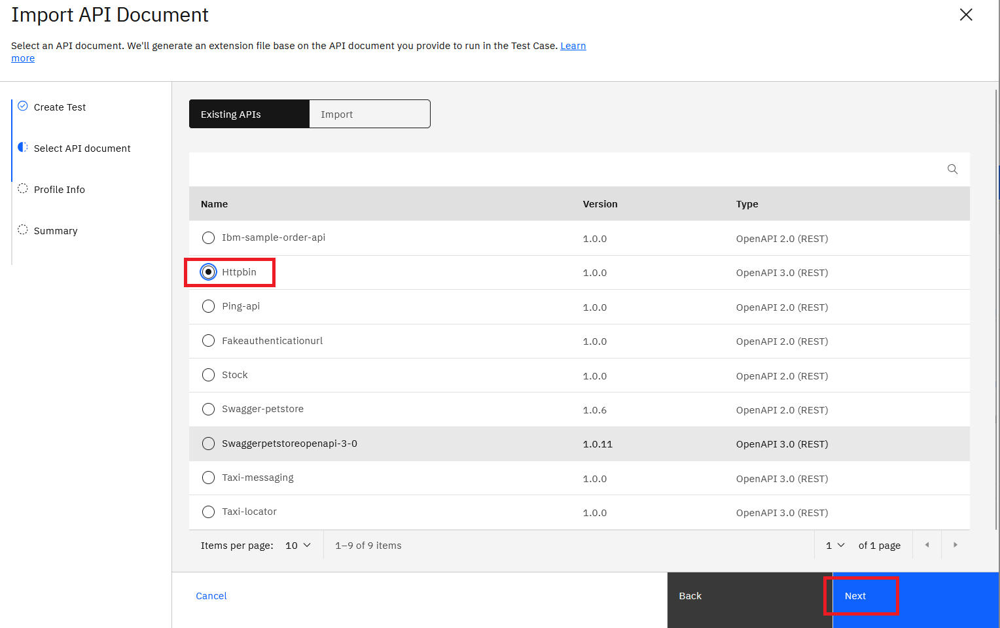

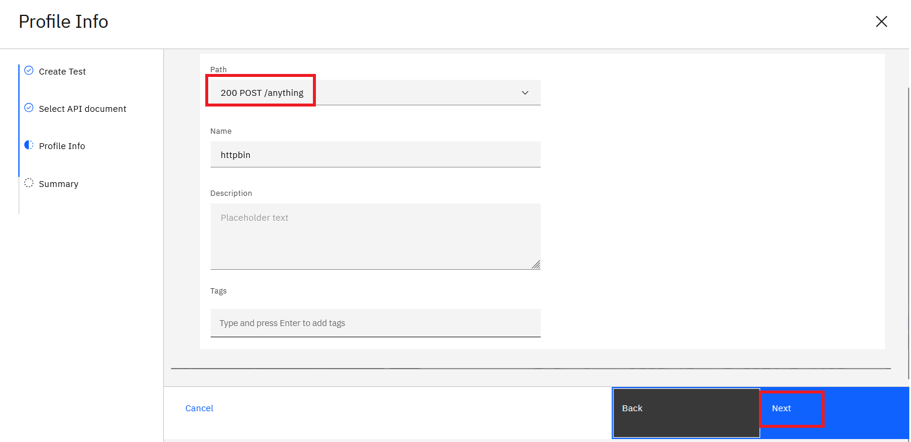

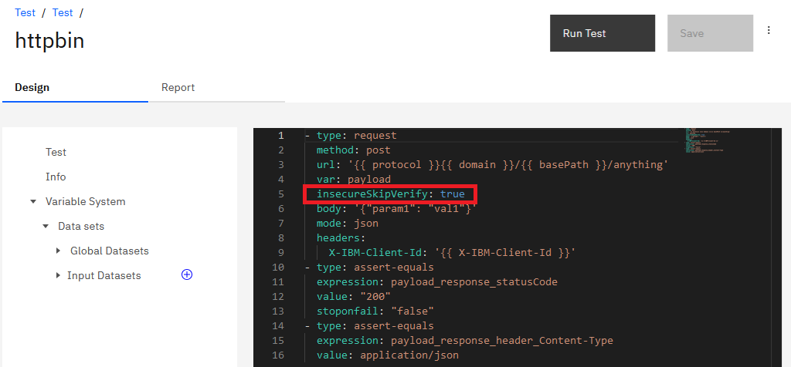

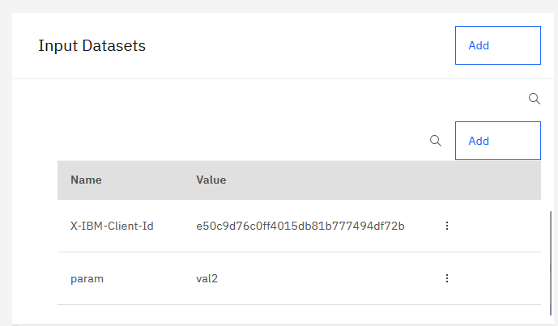

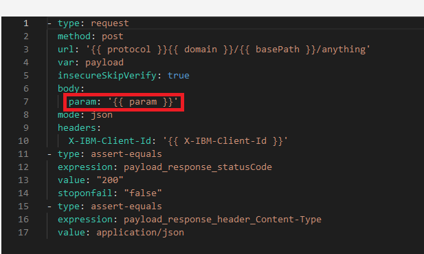

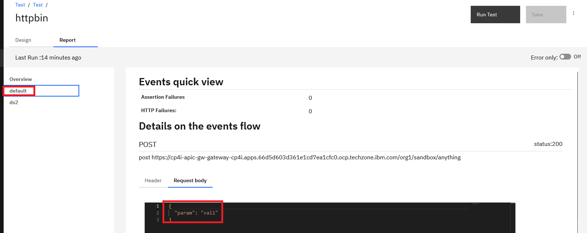

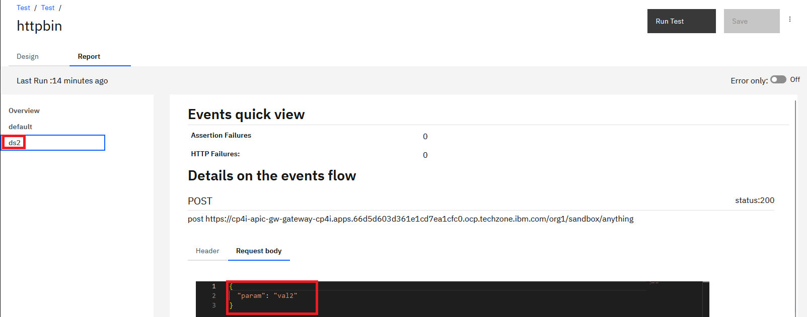

## Backup

``` bash
oc -n cp4i create secret generic apic-mgmt-backup-secret --from-literal=username='foo' --from-literal=password='123'
oc -n cp4i get ManagementCluster
oc -n cp4i get cluster
oc -n cp4i create -f mgmtbackup_cr.yaml
oc -n cp4i get backup -o custom-columns="name:.metadata.name,backupId:.status.backupId,endpoint:.status.endpointURL,path:.status.destinationPath,servername:.status.serverName,status:.status.phase"
```

``` bash
kubectl -n <management namespace> create secret generic mgmt-backup-secret --from-literal=username='<username>' --from-file=ssh-privatekey='<privatekeyfile>' [--from-literal=password='<privatekey_passphrase>']
```

``` bash
kubectl -n apic create secret generic mgmt-backup-secret --from-literal=username='itzuser' --from-file=ssh-privatekey='backup.pem'
```

``` bash
kubectl -n <management namespace> edit ManagementCluster
```

``` bash
kubectl -n apic edit ManagementCluster
```

``` bash
  databaseBackup:
    protocol: sftp
    host: 158.175.178.166
    port: 2223
    path: /home/itzuser/backup/apic
    credentials: mgmt-backup-secret
    repoRetentionFull: 14
    schedule: 0 0 1 * * *
```

``` bash
kubectl -n <management namespace> get cluster
kubectl -n apic get cluster
kubectl get cluster -n apic
NAME                     AGE   INSTANCES   READY   STATUS                     PRIMARY
management-ed88e890-db   26d   1           1       Cluster in healthy state   management-ed88e890-db-1
```

``` bash
apiVersion: postgresql.k8s.enterprisedb.io/v1
kind: Backup
metadata:
  generateName: mgmt-backup- # prefix for the name of the backup CR that is generated.
spec:
  cluster:
    name: <database cluster name>
````

``` bash
apiVersion: postgresql.k8s.enterprisedb.io/v1
kind: Backup
metadata:
  generateName: mgmt-backup- # prefix for the name of the backup CR that is generated.
spec:
  cluster:
    name: management-ed88e890-db
```

Create the Backup CR from the mgmtbackup_cr.yaml file:

``` bash
kubectl -n <management namespace> create -f mgmtbackup_cr.yaml
```

Create the Backup CR from the mgmtbackup_cr.yaml file:

``` bash
kubectl -n apic create -f mgmtbackup_cr.yaml
kubectl -n <management namespace> get backup -o custom-columns="name:.metadata.name,backupId:.status.backupId,endpoint:.status.endpointURL,path:.status.destinationPath,servername:.status.serverName,status:.status.phase"
kubectl -n apic get backup -o custom-columns="name:.metadata.name,backupId:.status.backupId,endpoint:.status.endpointURL,path:.status.destinationPath,servername:.status.serverName,status:.status.phase"
name                backupId          endpoint                                   path               servername                                  status
mgmt-backup-bgpbb   20241222T110515   https://management-s3proxy.apic.svc:8765   s3://edb-backups   management-ed88e890-db-2024-11-25T221339Z   completed
```

## Restore

``` bash
kubectl get mgmt -n apic
NAME         READY   STATUS    VERSION         RECONCILED VERSION   MESSAGE               AGE
management   18/18   Running   10.0.8.1-1110   10.0.8.1-1110        Management is ready   87m
kubectl -n <management namespace> get ManagementRestore --sort-by=.metadata.creationTimestamp
kubectl -n apic get ManagementRestore --sort-by=.metadata.creationTimestamp
kubectl -n apic get ManagementRestore --sort-by=.metadata.creationTimestamp
NAME                 STATUS              MESSAGE                                     BACKUP   CLUSTER      PITR   AGE
mgmt-restore-pk4bt   RestoreInProgress   Waiting on management services to disable            management          59s
```

``` yaml
apiVersion: management.apiconnect.ibm.com/v1beta1
kind: ManagementRestore
metadata:
  generateName: mgmt-restore- # this the prefix for the name of the restore CR that is created
spec:
  subsystemName: management
  backup:
    protocol: sftp
    host: 158.175.178.166
    port: 2223
    path: /home/itzuser/backup/apic/management-ed88e890-db-2024-11-25T221339Z
    credentials: mgmt-backup-secret
  backupId: 20241222T110515
```

``` yaml
apiVersion: postgresql.k8s.enterprisedb.io/v1
kind: Backup
metadata:
  generateName: mgmt-backup- # prefix for the name of the backup CR that is generated.
spec:
  cluster:
    name: management-ed88e890-db
```

## AI API Agent

For the installation of Milvus check the install_milvus function, we have chosen a standalone deployment.

### Check Milvus is running

To check milvus is installed 

``` bash
oc get po -n milvus-operator
NAME                                                         READY   STATUS    RESTARTS   AGE
apic-ai-agent-milvus-db-etcd-0                               1/1     Running   0          16h
apic-ai-agent-milvus-db-kafka-0                              1/1     Running   0          16h
apic-ai-agent-milvus-db-kafka-1                              1/1     Running   0          16h
apic-ai-agent-milvus-db-kafka-2                              1/1     Running   0          16h
apic-ai-agent-milvus-db-kafka-zookeeper-0                    1/1     Running   0          16h
apic-ai-agent-milvus-db-kafka-zookeeper-1                    1/1     Running   0          16h
apic-ai-agent-milvus-db-kafka-zookeeper-2                    1/1     Running   0          16h
apic-ai-agent-milvus-db-milvus-standalone-7f7798d4d5-mrtsn   1/1     Running   0          16h
apic-ai-agent-milvus-db-minio-c5c77568c-r86h7                1/1     Running   0          16h
milvus-operator-6f77449dd9-hv5nr                             1/1     Running   0          16h
```

### Getting the service and port

``` bash
NAME                             TYPE           CLUSTER-IP       EXTERNAL-IP   PORT(S)                          AGE
apic-ai-agent-milvus-db-milvus   LoadBalancer   172.30.187.191   <pending>     19530:31104/TCP,9091:30529/TCP   19h
```

### Create the route

``` bash
oc create route edge milvus-route --service=apic-ai-agent-milvus-db-milvus --port=milvus
```

### Test Milvus is working

We are going to use PyMilvus, a Milvus’s Python SDK, to connect to the cluster and perform basic operations.

To interact with Milvus via Python, you need to install the pymilvus package:

``` bash
pip install pymilvus
```

In my case, I had to use a virtual environment for pyhton to be able to download the pymilvus package.

``` bash
cd ~/venvs/
source env/bin/activate
python3 -m pip show pymilvus
Name: pymilvus
Version: 2.6.3
Summary: Python Sdk for Milvus
Home-page: 
Author: Milvus Team
Author-email: milvus-team@zilliz.com
License: 
Location: /home/desprets/venvs/env/lib/python3.12/site-packages
Requires: grpcio, orjson, pandas, protobuf, python-dotenv, setuptools
Required-by: 
```

I'm using the code located on github.com/milvus-io/pymilvus Git repository.
Especially the manage_milvus_client.py file. The instructions are on https://github.com/milvus-io/pymilvus/blob/master/examples/manage_milvus_client/how_to_manage_milvus_client.md.


Update and Use tools/connect.py to test connection (python3 connect.py)
Update and Use tools/test.py to test milvusdb
Update and Use tools/chgpasswd.py to change default root password

### Configure APIC Custom Resources

The instructions provide information on enabloing the AI API Agent in APIC [here](https://www.ibm.com/docs/en/api-connect/software/10.0.x_cd?topic=subsystem-enabling-api-agent-management). Basically, 

### Configure APIC API Agent

Notice that this is done at an organisation level

SaaS
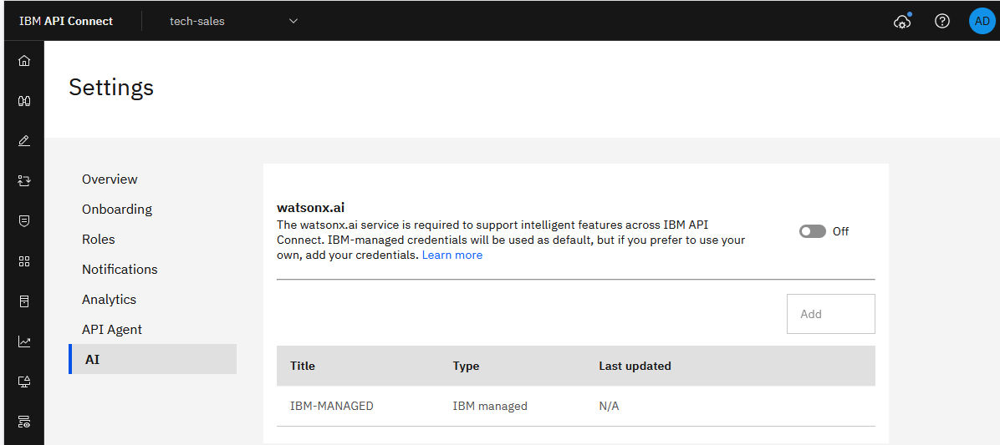

onPrem
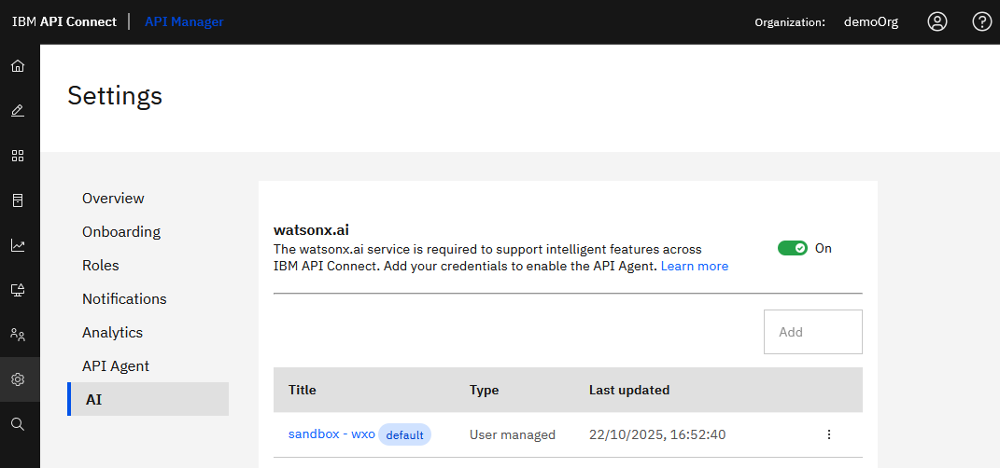

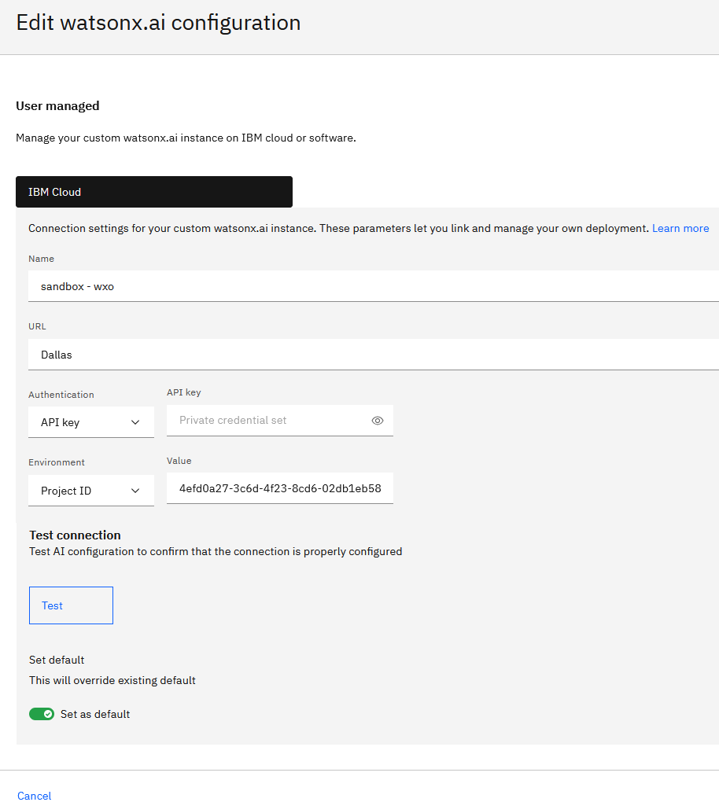

### Configure VS Code extension

You need to download the VS code plugin for API Agent from the Cloud Manager first. (AI must be enabled first in the CRD)

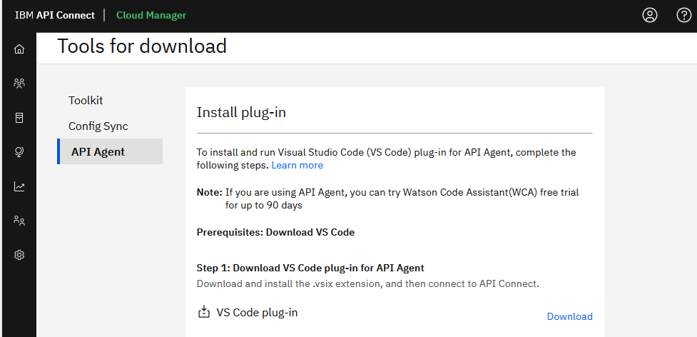
When the plugin (extension: .vsix) for example api-agent-vscode-plugin-10.0.10-165 is downloaded, you can set it up in VS Code. In VS Code, In the left panel, open Extensions, click the Views and More Actions icon (...), and select Install from VSIX.

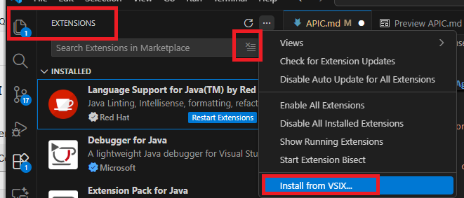

Configure host to API Manager and login

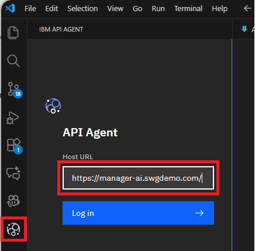


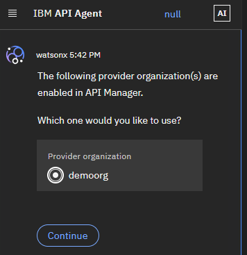

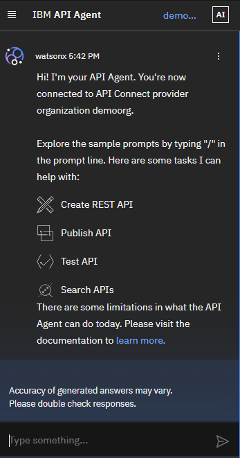

### Testing API Connect Agent

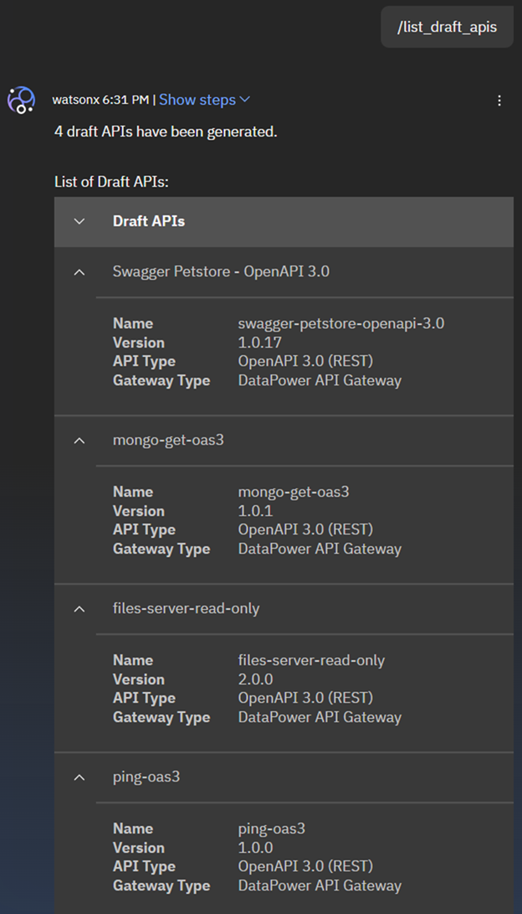

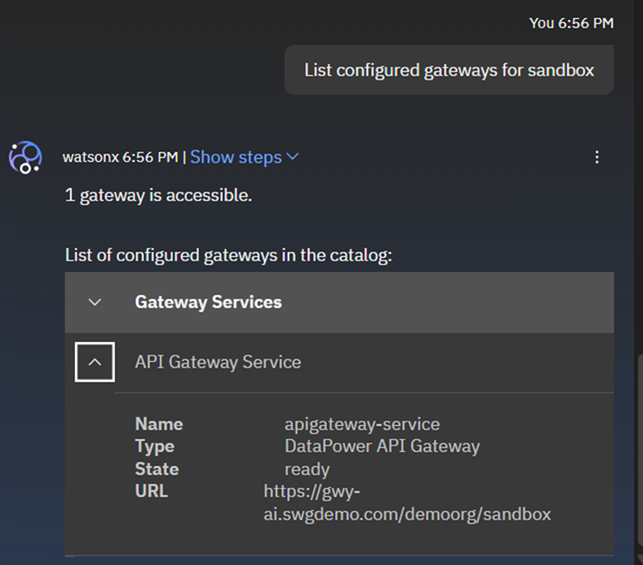

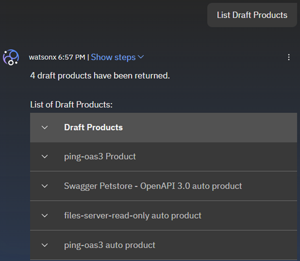


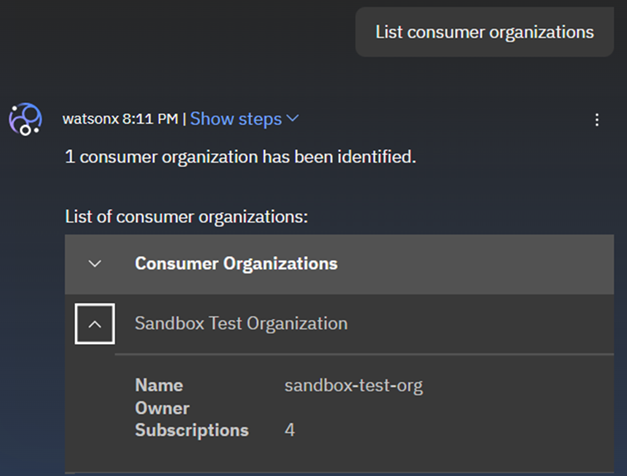

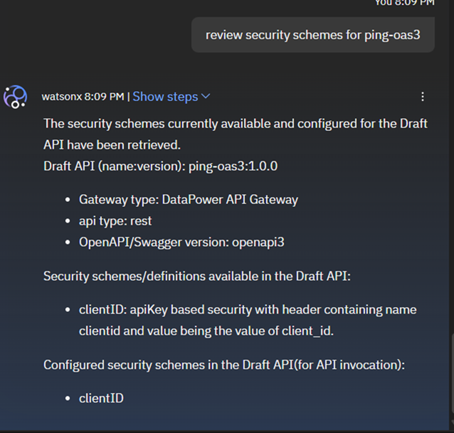

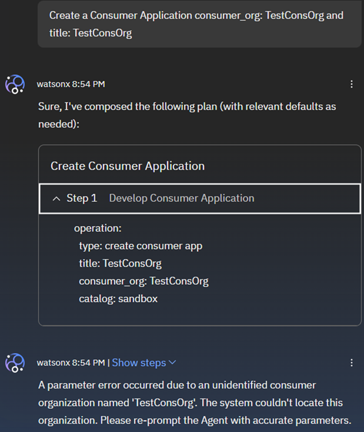

#### List API

#### Create test

#### Create mock API

#### NLP Processing

