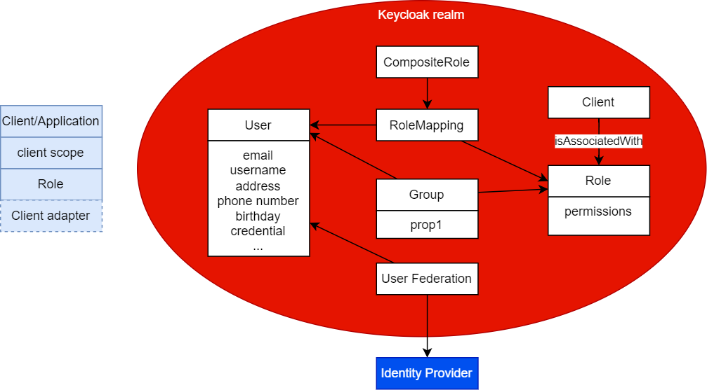
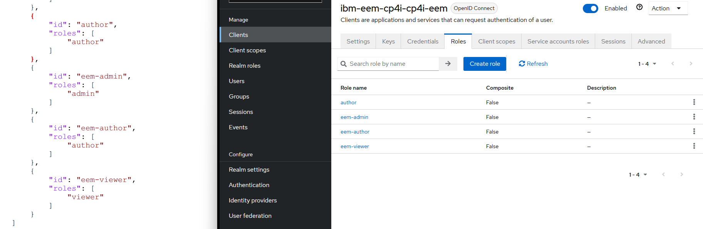
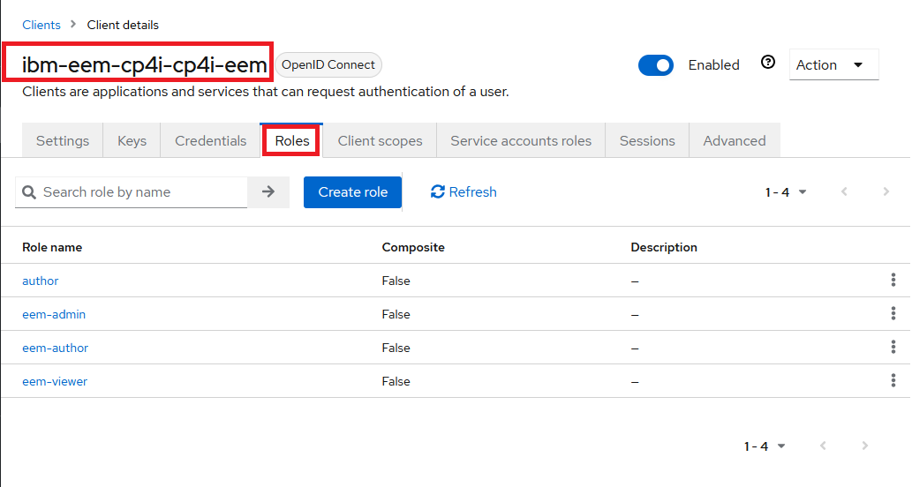
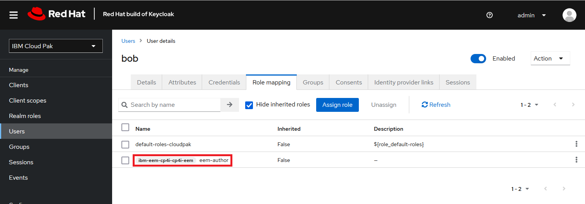

# Keycloak usage

## Overview

Keycloak is a single sign on solution for web apps and RESTful web services. The goal of Keycloak is to make security simple so that it is easy for application developers to secure the apps and services they have deployed in their organization.

[Keycloak admin page](https://www.keycloak.org/docs/latest/server_admin/ "Keycloak admin page")

Keycloak is a separate server that you manage on your network. Applications are configured to point to and be secured by this server. Keycloak uses open protocol standards like OpenID Connect or SAML 2.0 to secure your applications. Browser applications redirect a user’s browser from the application to the Keycloak authentication server where they enter their credentials. This redirection is important because users are completely isolated from applications and applications never see a user’s credentials. These tokens can have identity information like username, address, email, and other profile data.

## Concepts



## Integration with CP4I

By default a realm is created when installing CP4I:


## Using LDAP

### Configure LDAP as a provider

In your realm, in the navigation panel click on User federation > Add Ldap providers
Select the vendor, for the provider you select the value you need, in my case "Other", Keycloak populates default values.


| Property                | Value                                      | Description |
|-------------------------|--------------------------------------------|-------------|
| UI display name         | ldap-oc                                    | Display     |
| Vendor                  | Other                                      | Specific    |
| Connection URL          | ldap://openldap.ldap.svc.cluster.local:389 | LDAP server |
| Enable Start TLS        | Off                                        |             |
| Use Truststore SPI      | Never                                      |             |
| Connection pooling      | On                                         |             |
| Connection timeout      | 30000                                      | Time in ms  |
| Bind type               | simple                                     |             |
| Bind DN                 | cn=admin,dc=ibm,dc=co                      |             |
| Bind credentials        | ********                                   |             |
| Edit mode               | READ_ONLY                                  |             |
| Users DN                | ou=users,dc=ibm,dc=com                     |             |
| Username LDAP attribute | uid                                        |             |
| RDN LDAP attribute      | uid                                        |             |
| UUID LDAP attribute     | entryUUID                                  |             |
| User object classes     | inetOrgPerson, organizationalPerson        |             |
| User LDAP filter        |                                            |             |
| Search scope            | One Level                                  |             |


### Import users

### Import groups

The following procedure imports groups from your LDAP directory. However, you can also assign LDAP users to Keycloak groups. For more information on Keycloak groups, see Managing users in Keycloak.
Import groups from an LDAP registry by adding a mapper to your LDAP provider.
    Log in to the Platform UI as a user with realm management permissions. For more information, see Cloud Pak for Integration roles and permissions.
    Click the Navigation Menu icon next to IBM Cloud Pak for Integration in the banner, then click Administration > Access control. The Keycloak access control console opens.
    In the navigation pane, click User federation.
    Select the LDAP provider from which you want to import groups.
    Click the Mappers tab.
    Click Add mapper.
        Enter a name (for example, groups).
        Select the group-ldap-mapper type.
        Enter your LDAP registry settings.
    Click Save.
The groups become available in Keycloak when users are synchronized from the LDAP registry. You can trigger synchronization manually by opening your LDAP provider configuration and using the Action menu.

## Use of the REST API

You need first to get a token to be able to use the Keycloak REST API.
https://github.com/IBM/event-automation-demo

### Get a token for Keycloak REST API

## Mapping role for a CRD

We are illustrating here the use of Keycloak and EEM.
On the left we find the definitions of the roles as defined within the Event Endpoint Management application, the client in Keycloak terminology. We retrieve on the right the definition in Keycloak. Notice, that as expected they are defined for a Client. The client also contains other definitions for OIDC setup for example. The definitions for the client in Keycloak are automatically generated by the operator.



For EventEndpointManagement, it is documented here: [EEM user roles page](https://ibm.github.io/event-automation/eem/security/user-roles/ "EEM user roles page").

In our tests, Alice is admin, bob is author and john is viewer.

spec -> manager -> authConfig -> authType
Either LOCAL or INTEGRATION_KEYCLOAK

The EEM instance will create secrets that needs to be patched.

- When using LOCAL, the two secrets {instance-name}-ibm-eem-user-credentials and {instance-name}-ibm-eem-user-roles with a definition B64 Encoded.

``` json
{"users":[{"username":"author1","password":"Password1"},{"username": "viewer1","password":"Password2"}]}
```

and

``` json
{"mappings":[{"id":"author1","roles":["author"]},{"id":"viewer1","roles":["viewer"]}]}
```

- When using INTEGRATION_KEYCLOAK, one secrets is patched {instance-name}-ibm-eem-user-roles with a definition B64 Encoded. In this example, there are 8 users mapped: admin, eventendpointmanagement-admin, eem-admin, integration-admin, eventendpointmanagement-viewer, eem-user, eem-author and author.


``` json
{"mappings":[ {"id":"admin","roles":["admin","author"]},  {"id":"eventendpointmanagement-admin","roles":["admin","author"]}, {"id":"eem-admin","roles":["admin"]}, {"id":"integration-admin","roles":["admin","author"]}, {"id":"eventendpointmanagement-viewer","roles":["viewer"]}, {"id":"eem-user","roles":["viewer"]}, {"id":"eem-author","roles":["author"]},  {"id":"author","roles":["author"]} ]}
```



### Assign the role in Keycloak to bob

- Click the name of the user or group that you want to work with.
- Click the Role mapping tab.
- Click Assign role.
- In the drop-down menu, select Filter by clients, and then click the eem-author role defined by the relevant Keycloak client.
- Click Assign.



### Sequence for login

---------------------------------------------------------------------------
Request GET
https://cp4i-eem-ibm-eem-manager-cp4i.apps.672291044cc643ed9e9ca3ba.ocp.techzone.ibm.com/

curl "https://cp4i-eem-ibm-eem-manager-cp4i.apps.672291044cc643ed9e9ca3ba.ocp.techzone.ibm.com/"  -H "Accept: text/html,application/xhtml+xml,application/xml;q=0.9,*/*;q=0.8"   

Response
HTTP/1.1 302 Found
location: https://keycloak-ibm-common-services.apps.672291044cc643ed9e9ca3ba.ocp.techzone.ibm.com/realms/cloudpak/protocol/openid-connect/auth?state=IYNYUi3g&redirect_uri=https%3A%2F%2Fcp4i-eem-ibm-eem-manager-cp4i.apps.672291044cc643ed9e9ca3ba.ocp.techzone.ibm.com%2Fcallback&code_challenge=pOoqVI2mKj-z8kDeI-5hircUIqR7UQfp-WwdkGTfERA&code_challenge_method=S256&scope=openid+email+profile&response_type=code&client_id=ibm-eem-cp4i-cp4i-eem

- state=IYNYUi3g
- redirect_uri=https%3A%2F%2Fcp4i-eem-ibm-eem-manager-cp4i.apps.672291044cc643ed9e9ca3ba.ocp.techzone.ibm.com%2Fcallback
- code_challenge=pOoqVI2mKj-z8kDeI-5hircUIqR7UQfp-WwdkGTfERA
- code_challenge_method=S256
- scope=openid+email+profile
- response_type=code
- client_id=ibm-eem-cp4i-cp4i-eem
---------------------------------------------------------------------------
2 requests
curl "https://keycloak-ibm-common-services.apps.672291044cc643ed9e9ca3ba.ocp.techzone.ibm.com/realms/cloudpak/protocol/openid-connect/auth?state=IYNYUi3g&redirect_uri=https^%^3A^%^2F^%^2Fcp4i-eem-ibm-eem-manager-cp4i.apps.672291044cc643ed9e9ca3ba.ocp.techzone.ibm.com^%^2Fcallback&code_challenge=pOoqVI2mKj-z8kDeI-5hircUIqR7UQfp-WwdkGTfERA&code_challenge_method=S256&scope=openid+email+profile&response_type=code&client_id=ibm-eem-cp4i-cp4i-eem"  -H "Accept: text/html,application/xhtml+xml,application/xml;q=0.9,*/*;q=0.8"

19.51 kB / 22.60 kB transferred
Finish: 836 ms
DOMContentLoaded: 453 ms
load: 835 ms

AUTH_SESSION_ID	
httpOnly	true
path	"/realms/cloudpak/"
samesite	"None"
secure	true
value	"ee3d6dcf-36d7-4072-880f-a0d85b5fe67e.cs-keycloak-0-23386"
AUTH_SESSION_ID_LEGACY	
e80d4ee8c54e7976bc34eed1070bc4c7	
value	"92858f647b60c2ff23af33ecc24ab310"
KC_RESTART	
value	"eyJhbGciOiJkaXIiLCJlbmMiOiJBMTI4Q0JDLUhTMjU2In0..d2uzapuFiokj7EOFIJPhZg.womnt3pzH9GkQR-M7-fpKAJuU-1uEbQyxPhKT7x50_29GXbbW-W-DPsBvGoyVTWB4xF99U3ZSNDryf7UXOrWlLkojFK7o9w-9cR3rp5HBFnr1EHthKDdJc8E6U9v-wTbxUV7uSd441hYW-hKtVMhLpmcwt53hyXPxruSsvRklEZ82m4V9XD6_E0LirJieG-WjDpmJ54Zk9_lINn2pCBlwSiPBsVRlDZtTNODHDO_LcKrRnV9Zj-HNwTs7M0MecjfrapCu0Q3ZJnI42W9T43_kt1qhvtIShWj-SGuhRTb1PLrKztcBp8tIi9_HWTHZ24wqYpxjaDq5HqgxXbivgCrgU09V72fDLRplpskOVHeDqWXY4oM5JueW_hzT_rPde0eN297FgpJgYnYk8UZsaDfuRIZ_SiZ4Kgxxwf5XRHmZzgCmhGp849Nvuf…VXllUT_FPu0u4AJw7Pnu93ZHq-EguLThB54Qqheopk34rma96q7_5N-eEonm3cRKoa_3LALEWYYG2h-yfliZv2xXFphNgKlCj8sAgvWSwMd8eiPhHY73xxiKGvDWK8mAy5JtA7fwaB9gZY5SXE3xw6Tf3sCVBpGmC8IJ2YaT4mFo17bMZ2azigfOyWDsj7v0bdiSxTsbF2V35nEInsstTOVkReCfBJlhVHGQsCnN_aRXQh5mBCZu08CddYKcNKrCw1pX9IWfpPZi9c1SlavSdrvYWsqQhP0yyH_dzJ5_XhpGo7Bdb9u61cKMfh9PkZ-HbsRbEdCUMwDXERp_rs9vUSrJFRgMBNZJLD6dRQ4phvBpijoPuTh7SVT_SvlAKbbUTlpZJY8AmcxALiKr8fxKoMqNzXbEZR8sL3VXpHl920uyiwJhcq2JyVtqX9KHSMTEXSbfjWEi1KUUF8iFsTaW4WTq5KksmDfGR6_4Q6w.N9IrdJ48c1P6fPMIbtAEbA"

Response:

Login page
---------------------------------------------------------------------------
3 POST
curl "https://keycloak-ibm-common-services.apps.672291044cc643ed9e9ca3ba.ocp.techzone.ibm.com/realms/cloudpak/login-actions/authenticate?session_code=KZBmhyGaBSKRsTbDP4x_dGEjXplKyWJaPz1obctQUXY&execution=e9da3fee-8248-4d4d-baa2-9f8c99e8f74a&client_id=ibm-eem-cp4i-cp4i-eem&tab_id=-Bwd6yydMmM" -X POST  -H "Accept: text/html,application/xhtml+xml,application/xml;q=0.9,*/*;q=0.8" -H "Content-Type: application/x-www-form-urlencoded" --data-raw "username=bob&password=Passw0rd^%^21&credentialId="

response 302 to
set-cookie: KEYCLOAK_IDENTITY=eyJhbGciOiJIUzUxMiIsInR5cCIgOiAiSldUIiwia2lkIiA6ICJlOTYyZjM5Yy01YWMyLTRhMzgtOWFhMC1mNmMxNDBkNzBkMDIifQ.eyJleHAiOjE3MzE0NTA2NjEsImlhdCI6MTczMTQwNzQ2MSwianRpIjoiYjkxYWQwNmMtZGU4NC00YTVjLTkwMWYtMGRjYmYxMjkyMWUyIiwiaXNzIjoiaHR0cHM6Ly9rZXljbG9hay1pYm0tY29tbW9uLXNlcnZpY2VzLmFwcHMuNjcyMjkxMDQ0Y2M2NDNlZDllOWNhM2JhLm9jcC50ZWNoem9uZS5pYm0uY29tL3JlYWxtcy9jbG91ZHBhayIsInN1YiI6ImE4MjQ0NzkzLTZmMjYtNDY5ZC1hZWRhLTA1ODY1ZDZkMTUzMCIsInR5cCI6IlNlcmlhbGl6ZWQtSUQiLCJzZXNzaW9uX3N0YXRlIjoiZGI2YzE4MDktMDEwYS00ZDQxLThkNjYtNDQ2OTU1ZjNhMDIyIiwic2lkIjoiZGI2YzE4MDktMDEwYS00ZDQxLThkNjYtNDQ2OTU1ZjNhMDIyIiwic3RhdGVfY2hlY2tlciI6InI1MXA1bWxJQm4yeURtV0FYNFJUaERyRmRFVmZVR1FNWTg5TDVlVm1NaEEifQ.CryRm71wzdfthBOHpmeGgksWArQZcOjBwRl0toDeWSZ7K5OQyZTTkJeQ9uk4dQ4SLcHELRWJ2yKa0GL1UJKNIg;Version=1;Path=/realms/cloudpak/;Secure;HttpOnly;SameSite=None
set-cookie: KEYCLOAK_SESSION="cloudpak/a8244793-6f26-469d-aeda-05865d6d1530/db6c1809-010a-4d41-8d66-446955f3a022";Version=1;Path=/realms/cloudpak/;Max-Age=43200;Secure;SameSite=None

location: https://cp4i-eem-ibm-eem-manager-cp4i.apps.672291044cc643ed9e9ca3ba.ocp.techzone.ibm.com/callback?state=RzxNa-id&session_state=db6c1809-010a-4d41-8d66-446955f3a022&iss=https%3A%2F%2Fkeycloak-ibm-common-services.apps.672291044cc643ed9e9ca3ba.ocp.techzone.ibm.com%2Frealms%2Fcloudpak&code=39edd922-70e0-4ad3-a1d0-e688d8e2d2ad.db6c1809-010a-4d41-8d66-446955f3a022.dcf257cf-e3d5-4bbf-bf65-82d758f6ad76

- state=RzxNa-id
- session_state=db6c1809-010a-4d41-8d66-446955f3a022
- iss=https%3A%2F%2Fkeycloak-ibm-common-services.apps.672291044cc643ed9e9ca3ba.ocp.techzone.ibm.com%2Frealms%2Fcloudpak
- code=39edd922-70e0-4ad3-a1d0-e688d8e2d2ad.db6c1809-010a-4d41-8d66-446955f3a022.dcf257cf-e3d5-4bbf-bf65-82d758f6ad76
---------------------------------------------------------------------------
curl "https://cp4i-eem-ibm-eem-manager-cp4i.apps.672291044cc643ed9e9ca3ba.ocp.techzone.ibm.com/callback?state=RzxNa-id&session_state=db6c1809-010a-4d41-8d66-446955f3a022&iss=https^%^3A^%^2F^%^2Fkeycloak-ibm-common-services.apps.672291044cc643ed9e9ca3ba.ocp.techzone.ibm.com^%^2Frealms^%^2Fcloudpak&code=39edd922-70e0-4ad3-a1d0-e688d8e2d2ad.db6c1809-010a-4d41-8d66-446955f3a022.dcf257cf-e3d5-4bbf-bf65-82d758f6ad76"  -H "Accept: text/html,application/xhtml+xml,application/xml;q=0.9,*/*;q=0.8"  -H "Cookie: ibm-ei-session=433ab4d75b493e6e59667ded80e77cb6440d03d14694e2ea0f0223ba3ad0c3f1; 7ba94db727003fa5cd31777137881dec=58a7b6f7888e210141c72c108da755c5"  
