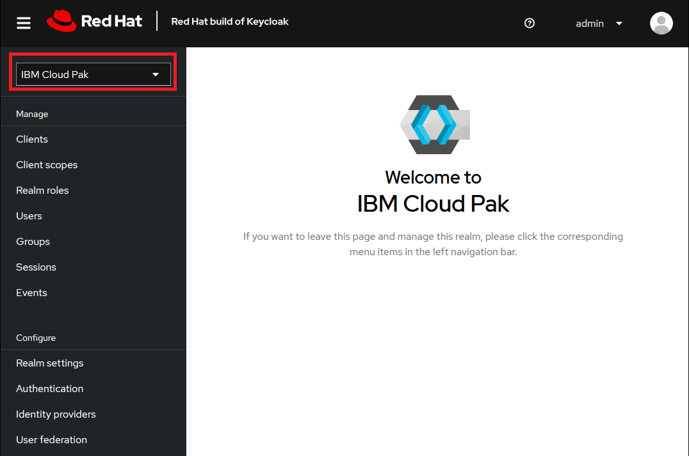
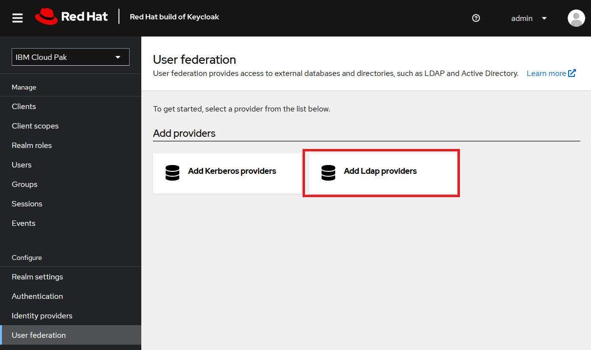
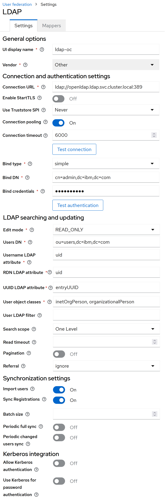

# Keycloak usage

## Overview

Keycloak is a single sign on solution for web apps and RESTful web services. The goal of Keycloak is to make security simple so that it is easy for application developers to secure the apps and services they have deployed in their organization.

[Keycloak admin page](https://www.keycloak.org/docs/latest/server_admin/ "Keycloak admin page")

Keycloak is a separate server that you manage on your network. Applications are configured to point to and be secured by this server. Keycloak uses open protocol standards like OpenID Connect or SAML 2.0 to secure your applications. Browser applications redirect a user’s browser from the application to the Keycloak authentication server where they enter their credentials. This redirection is important because users are completely isolated from applications and applications never see a user’s credentials. These tokens can have identity information like username, address, email, and other profile data.

## Integration with CP4I

By default a realm is created when installing CP4I:

## Using LDAP

### Configure LDAP as a provider

In your realm, in the navigation panel click on User federation > Add Ldap providers
Select the vendor, for the provider you select the value you need, in my case "Other", Keycloak populates default values.

| Property                | Value                                      | Description |
|-------------------------|--------------------------------------------|-------------|
| UI display name         | ldap-oc                                    | Display     |
| Vendor                  | Other                                      | Specific    |
| Connection URL          | ldap://openldap.ldap.svc.cluster.local:389 | LDAP server |
| Enable Start TLS        | Off                                        |             |
| Use Truststore SPI      | Never                                      |             |
| Connection pooling      | On                                         |             |
| Connection timeout      | 30000                                      | Time in ms  |
| Bind type               | simple                                     |             |
| Bind DN                 | cn=admin,dc=ibm,dc=co                      |             |
| Bind credentials        | ********                                   |             |
| Edit mode               | READ_ONLY                                  |             |
| Users DN                | ou=users,dc=ibm,dc=com                     |             |
| Username LDAP attribute | uid                                        |             |
| RDN LDAP attribute      | uid                                        |             |
| UUID LDAP attribute     | entryUUID                                  |             |
| User object classes     | inetOrgPerson, organizationalPerson        |             |
| User LDAP filter        |                                            |             |
| Search scope            | One Level                                  |             |

### Import users

### Import groups

The following procedure imports groups from your LDAP directory. However, you can also assign LDAP users to Keycloak groups. For more information on Keycloak groups, see Managing users in Keycloak.
Import groups from an LDAP registry by adding a mapper to your LDAP provider.
    Log in to the Platform UI as a user with realm management permissions. For more information, see Cloud Pak for Integration roles and permissions.
    Click the Navigation Menu icon next to IBM Cloud Pak for Integration in the banner, then click Administration > Access control. The Keycloak access control console opens.
    In the navigation pane, click User federation.
    Select the LDAP provider from which you want to import groups.
    Click the Mappers tab.
    Click Add mapper.
        Enter a name (for example, groups).
        Select the group-ldap-mapper type.
        Enter your LDAP registry settings.
    Click Save.
The groups become available in Keycloak when users are synchronized from the LDAP registry. You can trigger synchronization manually by opening your LDAP provider configuration and using the Action menu.

## Use of the REST API

You need first to get a token to be able to use the Keycloak REST API.

### Get a token for Keycloak REST API
