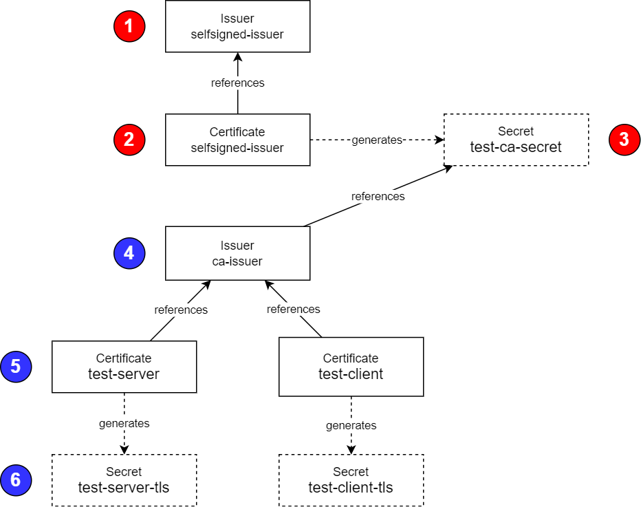

# Certificate management

## Concepts: Issuer, Certificates and Secret

This page describes the concetps behind the generation of certificates in Kubernetes, it belongs to API Connect documentation, but this information is generic and applies to the generation of certificates in Kubernetes for any situations. [Key Concepts: Cert-manager, Issuers, and Secrets](https://www.ibm.com/docs/en/api-connect/10.0.8?topic=deployment-key-concepts-cert-manager-issuers-secrets). The cert-manager Operator for Red Hat OpenShift is a cluster-wide service that provides application certificate lifecycle management. The cert-manager Operator for Red Hat OpenShift allows you to integrate with external certificate authorities and provides certificate provisioning, renewal, and retirement.

In cert-manager, the Certificate resource represents a human readable definition of a certificate request. cert-manager uses this input to generate a private key and CertificateRequest resource in order to obtain a signed certificate from an Issuer or ClusterIssuer. The signed certificate and private key are then stored in the specified Secret resource. cert-manager will ensure that the certificate is auto-renewed before it expires and re-issued if requested.

I'm using here the Certificate approach and not the CertificateRequest one. For information how to specify all the attributes of a certificate, you can look at the documentation here: [Certificate resource](https://cert-manager.io/docs/usage/certificate/).

Possible values for key usage are: "key encipherment", "digital signature", "client auth", "server auth", "signing", "cert sign", "code signing", "crl sign", "ocsp signing", "s/mime", "encipher only", "data encipherment", "content commitment", "decipher only", "email protection", "key agreement", "timestamping", "ipsec end system", "ipsec tunnel", "ipsec user", "microsoft sgc", "netscape sgc", "any".



You first start by creating a simple self-signed issuer for the root certificate (1).

```yaml
apiVersion: cert-manager.io/v1
kind: Issuer
metadata:
  name: <ca_issuer_name>
  namespace: <namespace>
spec:
  selfSigned: {}
```

Then you create the Certificate which contains the specifications for this self-signed Certificate (2).

```yaml
apiVersion: cert-manager.io/v1
kind: Certificate
metadata:
  name: <cacert_name>
  namespace: <namespace>
spec:
  commonName: <cacert_name>
  duration: 87600h0m0s
  isCA: true
  issuerRef:
    kind: Issuer
    name: <issuer_name (1)>
  privateKey:
    algorithm: RSA
    rotationPolicy: Always
    size: 2048
  renewBefore: 720h0m0s
  secretName: <cacert_name>
  secretTemplate:
    labels:
      app.kubernetes.io/component: mq-demo
  usages:
  - key encipherment
  - digital signature
```

Now you can create the issuer for signed certificate referencing the secret newly created (4).

```yaml
apiVersion: cert-manager.io/v1
kind: Issuer
metadata:
  name: <tls_issuer_name>
  namespace: cp4i
spec:
  ca:
    secretName: <signer_secret_ref_name>
```

And define the Certificates that will be used for TLS communication, in our case we have a client and a server certificate (5).
For the naming convention, we are using here: <namespace>-<qm-name>-<client/server>

```yaml
apiVersion: cert-manager.io/v1
kind: Certificate
metadata:
  name: <tls_server_cert_name>
  namespace: <namespace>
spec:
  commonName: <tls_server_cert_name>
  dnsNames:
  - <tls_server_cert_name>-<namespace>.apps.66d5d603d361e1cd7ea1cfc0.ocp.techzone.ibm.com
  duration: 17520h0m0s
  issuerRef:
    kind: Issuer
    name: <tls_issuer_name>
  privateKey:
    algorithm: RSA
    rotationPolicy: Always
    size: 2048
  renewBefore: 720h0m0s
  secretName: <signer_secret_ref_name>
  secretTemplate:
    labels:
      app.kubernetes.io/component: mq-demo
  usages:
  - key encipherment
  - digital signature
  - server auth
```

Below a screen capture of the resources created.

")

## Replacing DataPower gateway Server certificate


## Using let's encrypt certificate

We need to create a Letsencrypt ClusterIssuer resource, we use the definition [LETS Encrypt Cluster Issuer](../../templates/resources/letsencrypt-issuer.yaml)

